### Tugas

1. kerjakan semua soal di masing-masing file yang telah disediakan
2. pastikan semua soal berhasil melewati test case yang telah disediakan
3. masukan hasil screenshot hasil test ke dalam readme.md ini
4. push tugas ke gitlab di branch masing-masing

format nama branch: `tugas-ruby-<nama>`

contoh: `tugas-ruby-irfan`

### Cara set up tugas

#### install minitest dengan perintah 
`bundle install`

#### jalankan seluruh test dengan perintah

`ruby tests/test_runner.rb -v documentation`

#### jalankan test untuk satu file dengan perintah

`ruby tests/<nama_file>.rb`

contoh: `ruby tests/1_test.rb`

#### lampirkan screenshot hasil test di bawah
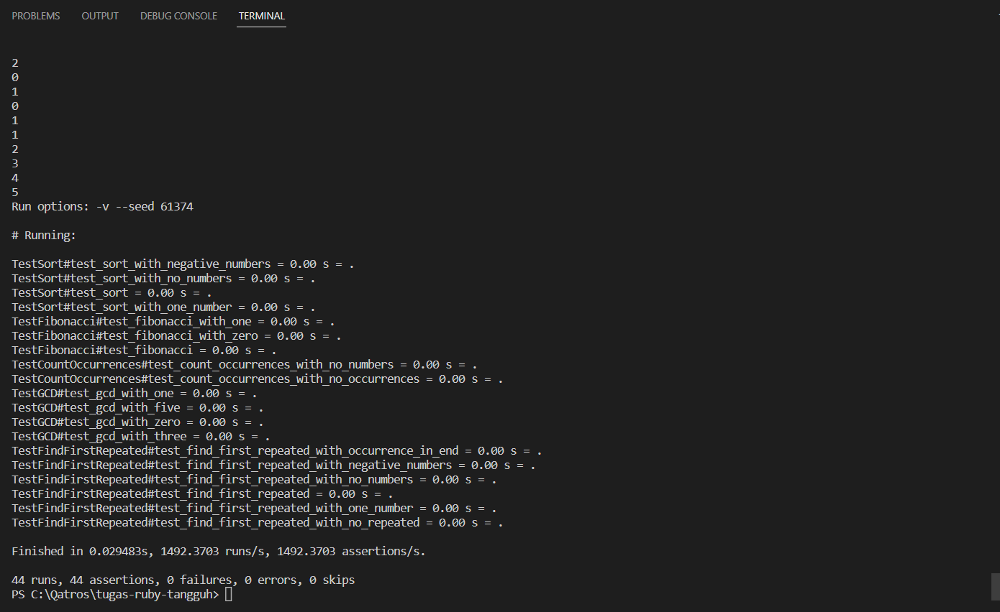
<!-- 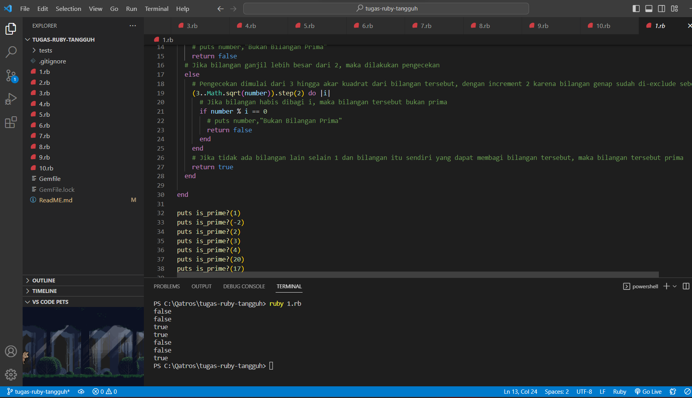
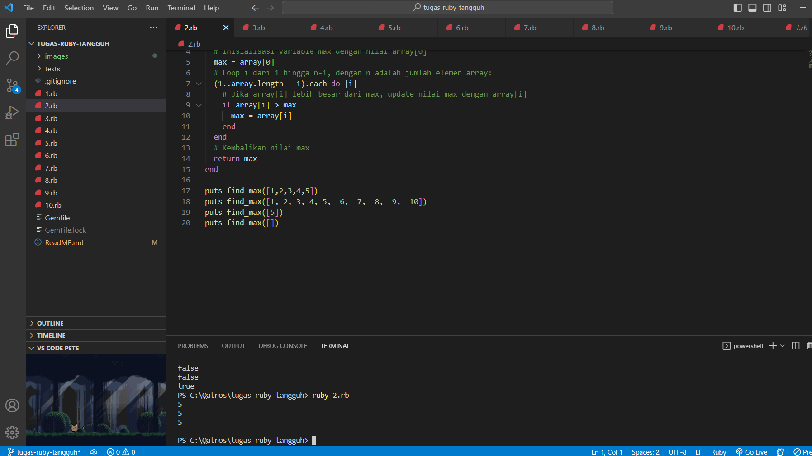
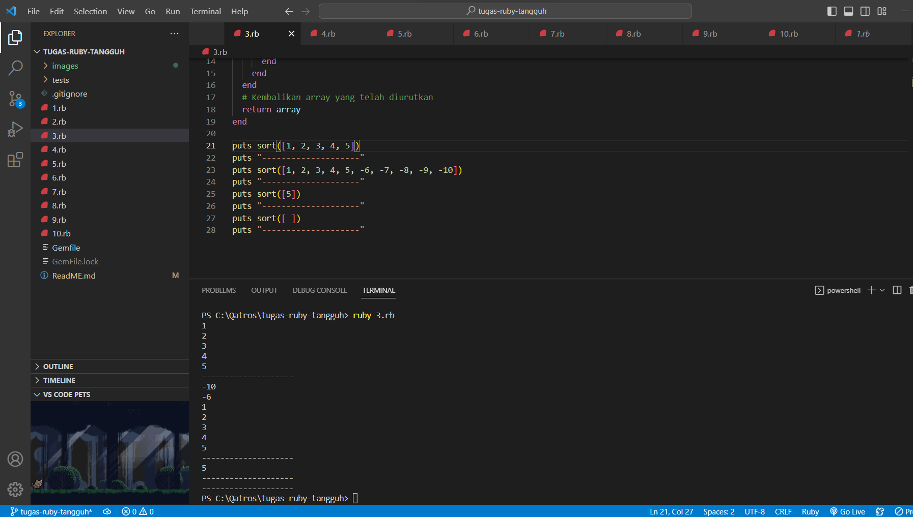
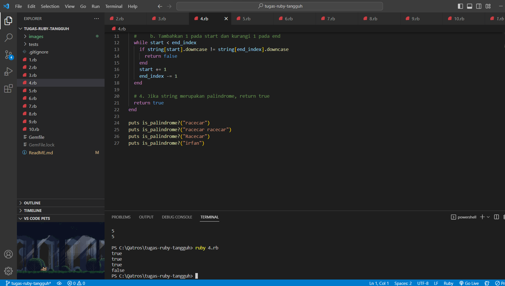
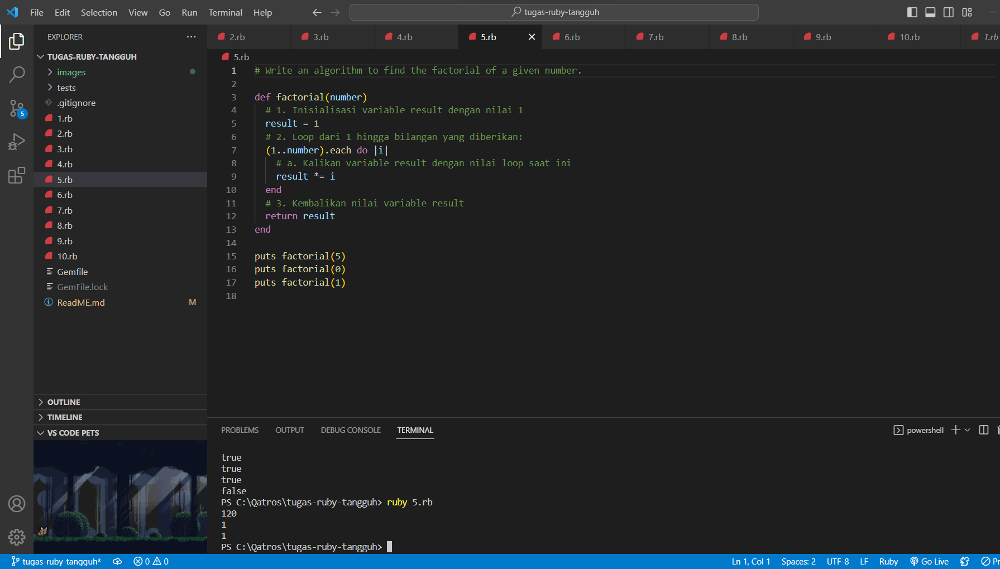
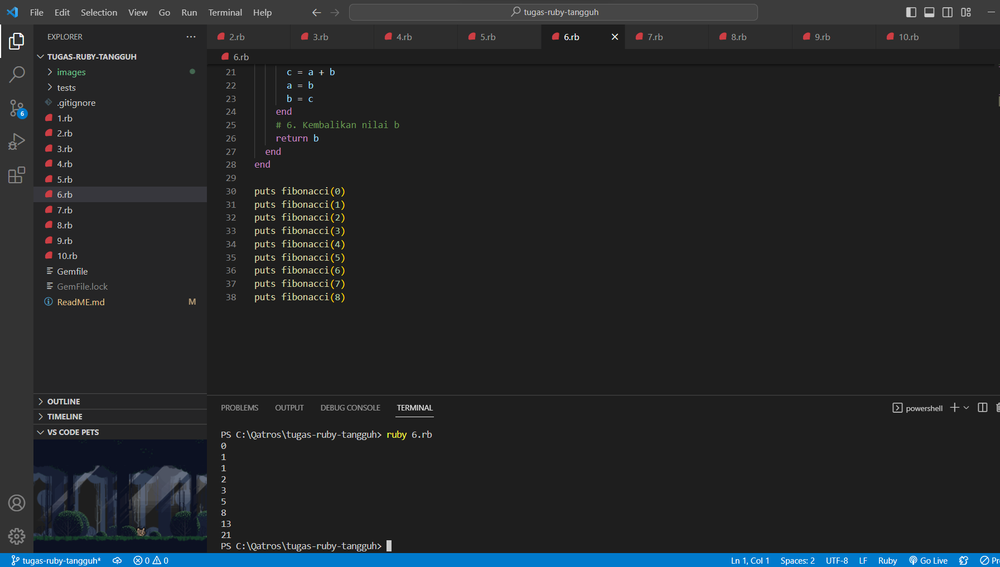
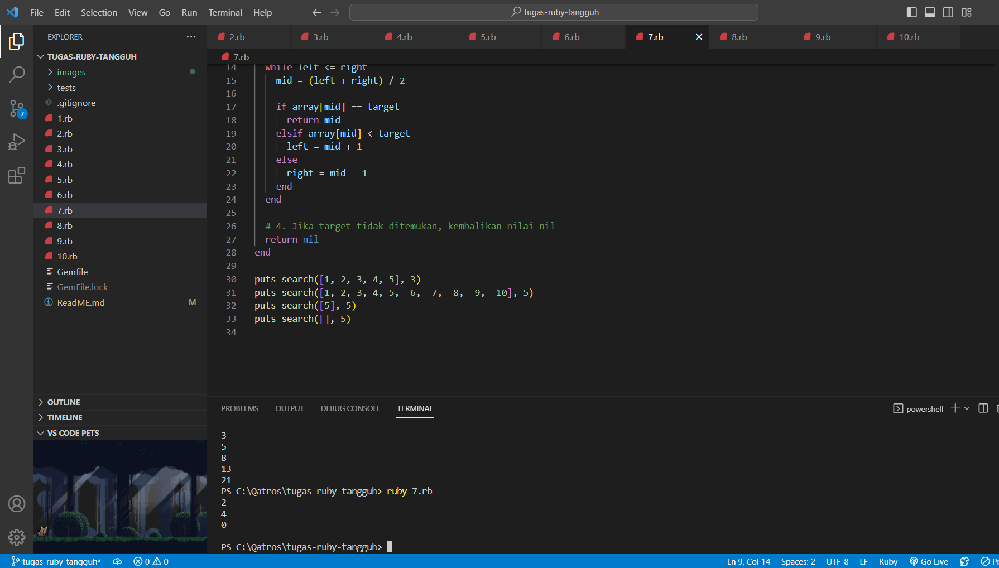
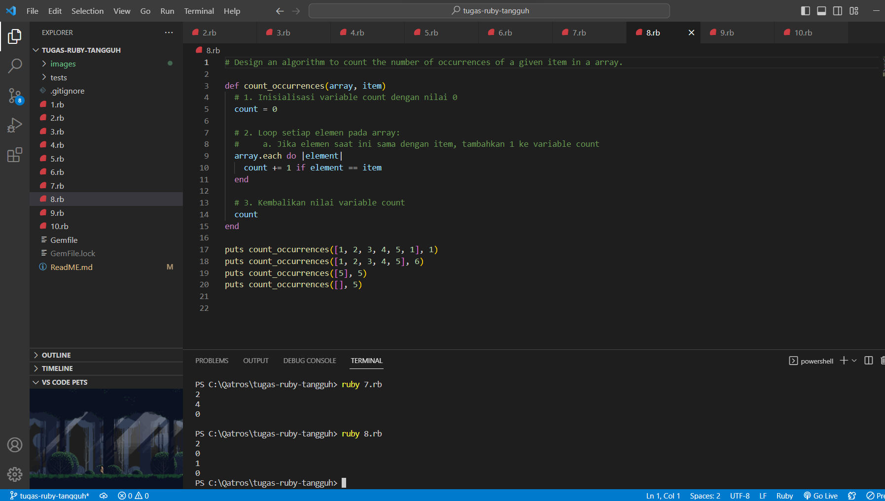
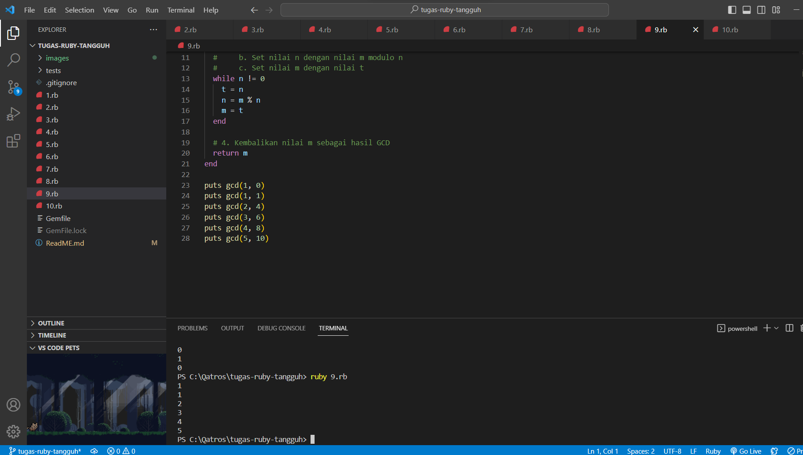
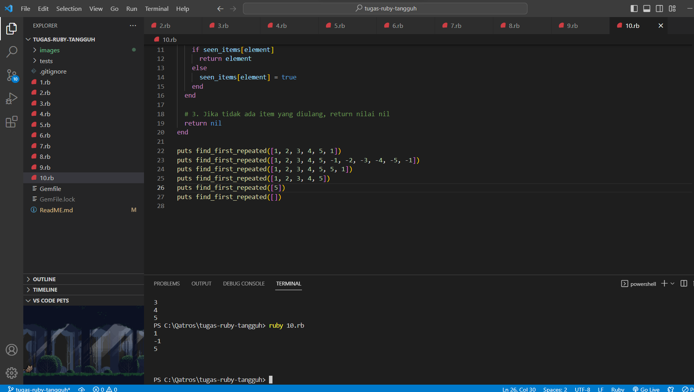 -->
